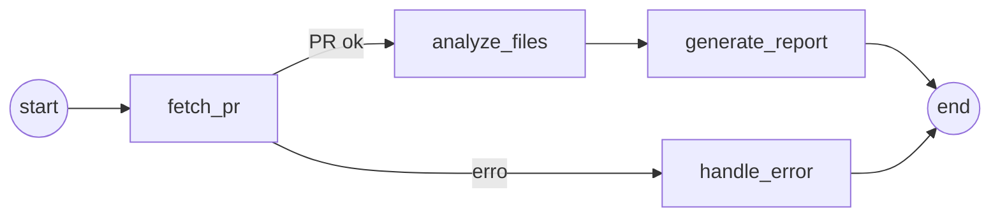

# pr-review-agent

Agente de revisão de Pull Requests do GitHub, implementado com [LangGraph](https://langchain-ai.github.io/langgraph/).

> Projeto avaliativo — módulo "IA para Desenvolvedores" (Mini-Projeto M1S05_06).

## Problema

Revisar Pull Requests manualmente é lento e repetitivo: o revisor precisa abrir
cada arquivo alterado, entender o diff, e procurar problemas óbvios (bugs,
riscos, más práticas) antes mesmo de avaliar decisões de design. Isso atrasa o
ciclo de revisão e consome tempo de desenvolvedores com tarefas que poderiam
ser triadas automaticamente.

## Objetivo

Revisar automaticamente um Pull Request do GitHub, apontando riscos,
problemas de estilo/boas práticas e um resumo das mudanças — funcionando como
uma primeira passada automatizada antes da revisão humana.

- **Entrada:** `owner/repo` + número do PR, ou a URL completa do PR.
- **Saída:** relatório estruturado em Markdown com resumo do PR, análise por
  arquivo e uma conclusão geral.

## Fluxo (LangGraph)



Estado compartilhado entre os nós (`agent/state.py`): `owner`, `repo`,
`pr_number`, `pr_info`, `files`, `file_analyses` (acumulado a cada arquivo
analisado), `report`, `error`.

| Nó | O que faz |
|---|---|
| `fetch_pr` | Valida a entrada, chama a API do GitHub, busca metadata do PR e o diff de cada arquivo alterado. Se faltar token, o PR não existir ou for inacessível, marca `error` no estado. |
| `analyze_files` | Para cada arquivo alterado, envia o diff ao LLM pedindo uma análise objetiva (bugs prováveis, riscos, sugestões). Os resultados vão se acumulando em `file_analyses` — é o "contexto/memória" do agente durante a execução. |
| `generate_report` | Consolida `pr_info` + `file_analyses` num relatório Markdown final. |
| `handle_error` | Nó alternativo, acionado pela aresta condicional quando `fetch_pr` marca um erro; devolve uma mensagem clara em vez de quebrar a execução. |

## Ferramenta integrada

**GitHub REST API** (via `requests`, em `agent/github_tool.py`), autenticada
com um Personal Access Token de escopo de leitura (`GITHUB_TOKEN`). Busca:

- `GET /repos/{owner}/{repo}/pulls/{pr_number}` — metadata do PR
- `GET /repos/{owner}/{repo}/pulls/{pr_number}/files` — lista de arquivos alterados e seus diffs (paginado)

Essa é uma chamada real à API — não simulada — e é o que alimenta a análise
do LLM.

## Modelo de linguagem

Claude Haiku 4.5 (Anthropic), acessado via [OpenRouter](https://openrouter.ai)
usando `langchain-openai` (`ChatOpenAI` com `base_url` apontando para a API
da OpenRouter). Ver decisão em [Decisões tomadas](#decisões-tomadas).

## Instruções de execução

### 1. Pré-requisitos

- Python 3.11+
- Uma conta na [OpenRouter](https://openrouter.ai/keys) com créditos, para gerar uma API key
- Um [Personal Access Token do GitHub](https://github.com/settings/tokens?type=beta) com escopo de leitura (Pull requests + Contents) no(s) repositório(s) que você for analisar

### 2. Setup

```bash
python3.11 -m venv .venv
source .venv/bin/activate          # Windows: .venv\Scripts\activate
pip install -r requirements.txt

cp .env.example .env
# edite o .env e preencha GITHUB_TOKEN e OPENROUTER_API_KEY
```

### 3. Rodar o agente

```bash
# owner/repo + número do PR
python main.py octocat/Hello-World 42

# ou a URL completa do PR
python main.py https://github.com/octocat/Hello-World/pull/42

# salvando o relatório em um arquivo
python main.py octocat/Hello-World 42 -o relatorio.md
```

## Exemplo de entrada/saída

**Entrada:**

```bash
python main.py https://github.com/rebelloguilherme/CrudAntDesign/pull/1
```

**Saída (trecho):**

```markdown
# Revisão do PR: feat: adiciona histórico de modificações de produtos

- **Autor:** rebelloguilherme
- **Branch:** `feat/historico-modificacoes` -> `main`
- **Arquivos analisados:** 23

## Análise por arquivo
### `backend/src/CrudAntDesign.Api/Controllers/ProdutosDapperController.cs`
• **Falta tratamento de erro**: O método não valida se o produto existe...
• **Sem paginação**: Histórico pode crescer indefinidamente...
• **Falta autorização**: Não há [Authorize] ou validação de permissão...
...

## Conclusão
Foram identificados pontos de atenção acima — revisar antes do merge.
```

O relatório completo gerado nesse teste está em
[`docs/exemplo-saida-pr1.md`](docs/exemplo-saida-pr1.md).

## Decisões tomadas

- **LangGraph com 4 nós** em vez de uma cadeia linear, para poder desviar
  explicitamente para `handle_error` via aresta condicional — atende ao
  requisito de "validação básica de entrada/saída/uso da ferramenta" sem
  misturar tratamento de erro com a lógica principal.
- **GitHub REST API via `requests`** em vez de `PyGithub`, por ser mais
  simples de auditar e não esconder as chamadas HTTP atrás de uma
  abstração — importante para um projeto de aprendizado.
- **Claude via OpenRouter, não Anthropic API direta**: a implementação
  original usava `langchain-anthropic` direto contra a API da Anthropic;
  trocamos para `langchain-openai` (`ChatOpenAI`) apontado para a
  OpenRouter por uma questão de billing/créditos disponíveis. A troca foi
  isolada em `agent/nodes.py` — o restante do grafo não muda.
- **`max_tokens` limitado (1024) por chamada de análise**: o valor default
  do modelo é muito alto para o que é pedido (até 5 bullets por arquivo) e
  esbarrava no limite de crédito da OpenRouter.
- **Limite de arquivos analisados (`MAX_FILES = 25`)** e de tamanho do
  diff por arquivo (`MAX_PATCH_CHARS = 6000`): evita custo/tempo
  descontrolado em PRs muito grandes.

## Limitações

- Não analisa arquivos binários ou diffs muito grandes (GitHub não retorna
  `patch` nesses casos) — o agente apenas sinaliza isso no relatório.
- PRs com mais de 25 arquivos alterados só têm os 25 primeiros analisados.
- A análise por arquivo é isolada: o modelo não tem visão do PR inteiro de
  uma vez, apenas do diff de cada arquivo + o resumo geral do PR.
- Não posta comentários de volta no GitHub — o resultado fica só no
  relatório local (Markdown no terminal ou em arquivo).
- Sem testes automatizados (fora do escopo do mini-projeto).
